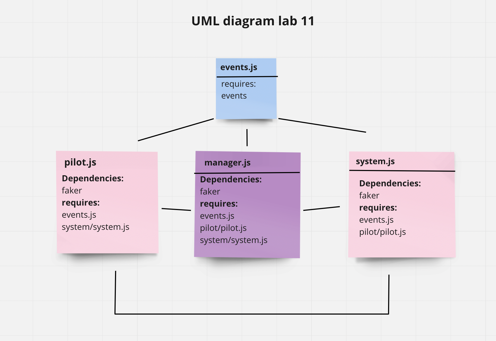

# airline-system

- i create message queue to store the events when the pilot is offline and send them back when he became online.(lab 13)
- i refactor the code to use socket.io instead of Node Events to handle the connections between multiple system components, which in turn facilitate real-time communication and allow bi-directional communication between client and server.(lab 12)

## UML Diagram

## links related to the project

[Actions](https://github.com/saraaltayeh/airline-system/actions)

[pull request](https://github.com/saraaltayeh/airline-system/pull/5)
